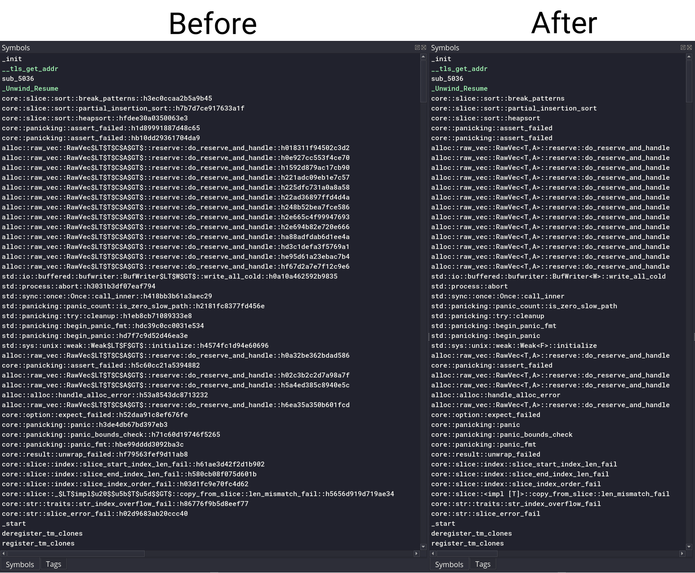

# Binary Ninja Rust demangle
Binary Ninja wrapper plugin for Alex Crichton's rustc-demangle crate

&nbsp;




# Installation
- Recursively clone this repository into your plugins folder
	```bash
	git clone --recursive https://github.com/samvdkris/binja-rust-demangle.git
	```
	Plugin folder locations:
	- **Linux:** `~/.binaryninja/plugins/`
	- **Windows:** `%appdata%/Binary Ninja/plugins/`
	- **MacOS:** `~/Library/Application Support/Binary Ninja/plugins/`

	(On Linux and MacOS, you can also clone this plugin to somewhere else and make a symlink)

- Compile Alex's rustc-demangle library:
	```bash
	cargo build -p rustc-demangle-capi --release --manifest-path rustc-demangle/Cargo.toml
	```

- You're done!
